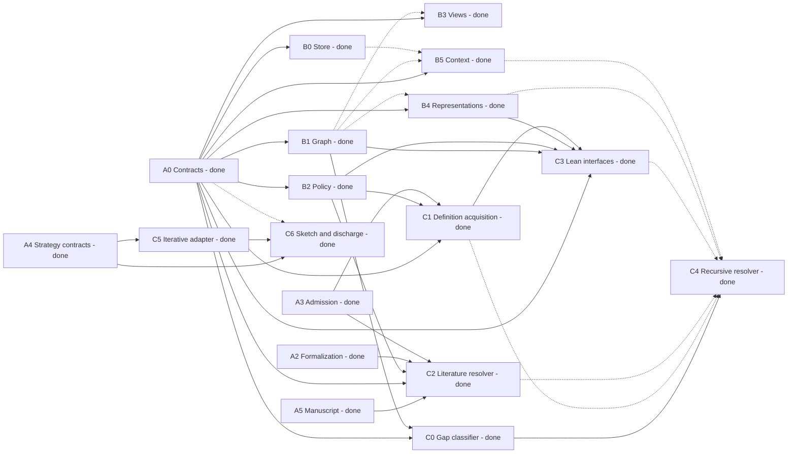
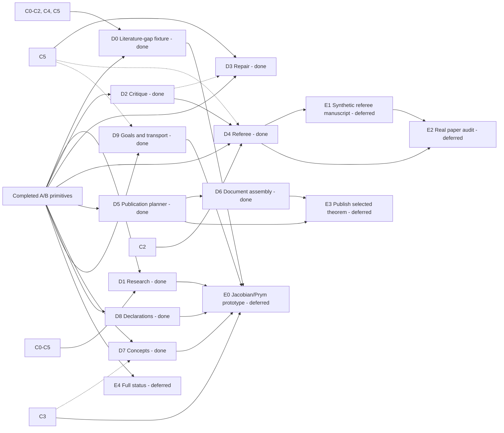
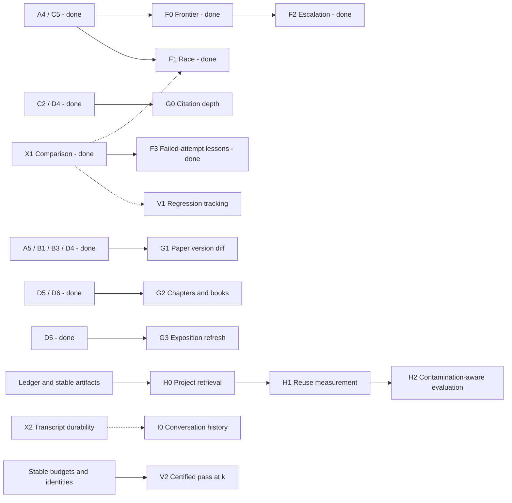

# Hardy TODO

Checked against the roadmap on 2026-09-10. This is a navigation and scheduling
index into the canonical [roadmap](docs/roadmap.md); its task definitions,
acceptance criteria, priorities, and dependency qualifications remain authoritative.

**Completed: 54 of 63 implementation/lane items (A0-A5, B0-B5, C0-C6, D0-D9, F0-F3, G0-G3, H0-H2, I0-I2, X0-X3, X5-X6, S0, S3 and V1-V3).**
Checkmarks mean the roadmap records the item as implemented. Core D and F-I passed their full hermetic landing gates. Unchecked items
are planned, ongoing, or not yet accepted in full. Update this index alongside
roadmap status changes. Defects remain in GitHub Issues.

Core A-D provide shared primitives and workflow APIs; application-specific
capability/model/search adapters and CLI/UI wiring remain later work. See the
[Core D verification report](docs/superpowers/reports/2026-09-10-core-d.md)
for validation results and integration limits.

Core F and X1 verification is tracked in the
[Core F report](docs/superpowers/reports/2026-09-10-core-f.md).

Core G verification and integration limits are in the
[Core G report](docs/superpowers/reports/2026-09-10-core-g.md).

Core H verification and measurement limits are in the
[Core H report](docs/superpowers/reports/2026-09-10-core-h.md).

Core I and X2 verification is in the
[Core I report](docs/superpowers/reports/2026-09-10-core-i.md).

S0/S3 verification and the unaccepted S1/S2 capability requirements are in the
[hardening report](docs/superpowers/reports/2026-09-10-hardening.md).
Execution remains unconfined. X4 and V0 remain ongoing.

The [engineering report](docs/superpowers/reports/2026-09-10-engineering.md)
records X0/X3/X5 acceptance and X6's completed residual audit/supported batch path.
X4 remains ongoing. X6's checkmark does not establish immutable remote model,
SDK or full worker-runtime identity. The first engineering full gate found one
production regression and three fixture failures; reviewed fixes are in place,
and the corrected source passed its fresh full gate (4,511 tests, 90.15%
coverage) and installed-wheel smoke.

V1-V3 acceptance scope, exact import measurements and the passed integrated
evaluation gate (4,569 tests, 90.08% coverage) are in the
[evaluation report](docs/superpowers/reports/2026-09-10-evaluation.md).
V0's [fixture index](docs/superpowers/reports/2026-09-10-acceptance-index.md)
remains an ongoing obligation rather than a completed universal acceptance claim.

## Available next work

**Skip all of Core E pending human input.** Remaining lane work is X4's CAS
late-stderr/prompt-timing and real Macaulay2 checks, S1's demonstrated confinement
capability gap, S2's dependent independent audit, and continuing V0 fixtures.
Core A-D and F-I primitives are implemented. Release milestones retain their
full integration/acceptance requirements and are not accepted by item counts.

## Dependency map

Arrows point from prerequisite to consumer. Solid arrows show required item
dependencies; dotted arrows show integration steps or conditional use. These
diagrams cover the near-term core. The checklist below supplies the complete
dependency index, including follow-on lanes and non-task prerequisites.

The workflow map groups shared prerequisites to keep the diagram readable.
The checklist gives the exact A/B subsets for each workflow; grouped nodes
do not add requirements to them.

The next sections can proceed without Core E. Dotted edges remain recommended
or measurement dependencies rather than additional mandatory prerequisites.

## Core A: contracts and seams

- [x] [A0 - Ledger contracts - P0](docs/roadmap.md#a0--ledger-contracts--p0) - Deps: none.
- [x] [A1 - Module-boundary tests for the new architecture - P0](docs/roadmap.md#a1--module-boundary-tests-for-the-new-architecture--p0) - Deps: none.
- [x] [A2 - Shared statement formalization - P0](docs/roadmap.md#a2--shared-statement-formalization--p0) - Deps: none conceptually; integrate with [A0](docs/roadmap.md#a0--ledger-contracts--p0) after contract freeze; consume [B4](docs/roadmap.md#b4--shared-conceptrepresentation-resolution--p0)/[B5](docs/roadmap.md#b5--shared-mathematical-contextdeclaration-management--p0) when available.
- [x] [A3 - Generic assumption admission policy - P0](docs/roadmap.md#a3--generic-assumption-admission-policy--p0) - Deps: none conceptually; integrate scope rule after [B2](docs/roadmap.md#b2--ledger-policy--p0).
- [x] [A4 - Proof-strategy contract - P0](docs/roadmap.md#a4--proof-strategy-contract--p0) - Deps: none.
- [x] [A5 - Mechanical manuscript-source model - P0](docs/roadmap.md#a5--mechanical-manuscript-source-model--p0) - Deps: none.

## Core B: persistent mathematical project

- [x] [B0 - Ledger event store - P0](docs/roadmap.md#b0--ledger-event-store--p0) - Deps: [A0](docs/roadmap.md#a0--ledger-contracts--p0).
- [x] [B1 - Ledger graph algorithms - P0](docs/roadmap.md#b1--ledger-graph-algorithms--p0) - Deps: [A0](docs/roadmap.md#a0--ledger-contracts--p0).
- [x] [B2 - Ledger policy - P0](docs/roadmap.md#b2--ledger-policy--p0) - Deps: [A0](docs/roadmap.md#a0--ledger-contracts--p0).
- [x] [B3 - Ledger derived views - P0](docs/roadmap.md#b3--ledger-derived-views--p0) - Deps: [A0](docs/roadmap.md#a0--ledger-contracts--p0); finalize against [B1](docs/roadmap.md#b1--ledger-graph-algorithms--p0).
- [x] [B4 - Shared concept/representation resolution - P0](docs/roadmap.md#b4--shared-conceptrepresentation-resolution--p0) - Deps: [A0](docs/roadmap.md#a0--ledger-contracts--p0); integrate graph queries after [B1](docs/roadmap.md#b1--ledger-graph-algorithms--p0).
- [x] [B5 - Shared mathematical context/declaration management - P0](docs/roadmap.md#b5--shared-mathematical-contextdeclaration-management--p0) - Deps: [A0](docs/roadmap.md#a0--ledger-contracts--p0); persist through [B0](docs/roadmap.md#b0--ledger-event-store--p0); integrate closure queries after [B1](docs/roadmap.md#b1--ledger-graph-algorithms--p0).

## Core C: acquisition and proof machinery

- [x] [C0 - Gap classifier - P0](docs/roadmap.md#c0--gap-classifier--p0) - Deps: [A0](docs/roadmap.md#a0--ledger-contracts--p0), [B1](docs/roadmap.md#b1--ledger-graph-algorithms--p0).
- [x] [C1 - Definition acquisition - P0](docs/roadmap.md#c1--definition-acquisition--p0) - Deps: [A0](docs/roadmap.md#a0--ledger-contracts--p0), [B2](docs/roadmap.md#b2--ledger-policy--p0), [A3](docs/roadmap.md#a3--generic-assumption-admission-policy--p0).
- [x] [C2 - Goal-directed literature resolver and citation contracts - P0](docs/roadmap.md#c2--goal-directed-literature-resolver-and-citation-contracts--p0) - Deps: [A5](docs/roadmap.md#a5--mechanical-manuscript-source-model--p0), [A0](docs/roadmap.md#a0--ledger-contracts--p0), [B2](docs/roadmap.md#b2--ledger-policy--p0), [A2](docs/roadmap.md#a2--shared-statement-formalization--p0), [A3](docs/roadmap.md#a3--generic-assumption-admission-policy--p0).
- [x] [C3 - Standard-object Lean interface materialization - P0](docs/roadmap.md#c3--standard-object-lean-interface-materialization--p0) - Deps: [A0](docs/roadmap.md#a0--ledger-contracts--p0), [B1](docs/roadmap.md#b1--ledger-graph-algorithms--p0), [B2](docs/roadmap.md#b2--ledger-policy--p0), [B4](docs/roadmap.md#b4--shared-conceptrepresentation-resolution--p0), [C1](docs/roadmap.md#c1--definition-acquisition--p0).
- [x] [C4 - Recursive obligation resolver - P0](docs/roadmap.md#c4--recursive-obligation-resolver--p0) - Deps: [C0](docs/roadmap.md#c0--gap-classifier--p0); register [C1](docs/roadmap.md#c1--definition-acquisition--p0)/[C2](docs/roadmap.md#c2--goal-directed-literature-resolver-and-citation-contracts--p0)/[C3](docs/roadmap.md#c3--standard-object-lean-interface-materialization--p0)/[B4](docs/roadmap.md#b4--shared-conceptrepresentation-resolution--p0)/[B5](docs/roadmap.md#b5--shared-mathematical-contextdeclaration-management--p0)-backed resolution as they land.
- [x] [C5 - Iterative strategy adapter - P0](docs/roadmap.md#c5--iterative-strategy-adapter--p0) - Deps: [A4](docs/roadmap.md#a4--proof-strategy-contract--p0).
- [x] [C6 - Sketch-and-discharge strategy - P1](docs/roadmap.md#c6--sketch-and-discharge-strategy--p1) - Deps: [A4](docs/roadmap.md#a4--proof-strategy-contract--p0), [C5](docs/roadmap.md#c5--iterative-strategy-adapter--p0); [A0](docs/roadmap.md#a0--ledger-contracts--p0) for durable semantic hole obligations.

## Core D: workflows

- [x] [D0 - Synthetic literature-gap acceptance fixture - P0](docs/roadmap.md#d0--synthetic-literature-gap-acceptance-fixture--p0) - Deps: [B0](docs/roadmap.md#b0--ledger-event-store--p0)-[B2](docs/roadmap.md#b2--ledger-policy--p0), [A2](docs/roadmap.md#a2--shared-statement-formalization--p0)-[A3](docs/roadmap.md#a3--generic-assumption-admission-policy--p0), [C0](docs/roadmap.md#c0--gap-classifier--p0)-[C2](docs/roadmap.md#c2--goal-directed-literature-resolver-and-citation-contracts--p0), [C4](docs/roadmap.md#c4--recursive-obligation-resolver--p0), [C5](docs/roadmap.md#c5--iterative-strategy-adapter--p0).
- [x] [D1 - Research workflow - P0](docs/roadmap.md#d1--research-workflow--p0) - Deps: [A0](docs/roadmap.md#a0--ledger-contracts--p0), [A2](docs/roadmap.md#a2--shared-statement-formalization--p0)-[A3](docs/roadmap.md#a3--generic-assumption-admission-policy--p0), [B0](docs/roadmap.md#b0--ledger-event-store--p0)-[B5](docs/roadmap.md#b5--shared-mathematical-contextdeclaration-management--p0), [C0](docs/roadmap.md#c0--gap-classifier--p0)-[C5](docs/roadmap.md#c5--iterative-strategy-adapter--p0).
- [x] [D2 - Critique workflow - P0/P1](docs/roadmap.md#d2--critique-workflow--p0p1) - Deps: [A0](docs/roadmap.md#a0--ledger-contracts--p0), [A2](docs/roadmap.md#a2--shared-statement-formalization--p0), [B0](docs/roadmap.md#b0--ledger-event-store--p0)-[B5](docs/roadmap.md#b5--shared-mathematical-contextdeclaration-management--p0).
- [x] [D3 - Repair workflow - P1](docs/roadmap.md#d3--repair-workflow--p1) - Deps: [A0](docs/roadmap.md#a0--ledger-contracts--p0), [B0](docs/roadmap.md#b0--ledger-event-store--p0)-[B2](docs/roadmap.md#b2--ledger-policy--p0), [C5](docs/roadmap.md#c5--iterative-strategy-adapter--p0); [D2](docs/roadmap.md#d2--critique-workflow--p0p1) for realistic inputs.
- [x] [D4 - Referee workflow - P0](docs/roadmap.md#d4--referee-workflow--p0) - Deps: [A5](docs/roadmap.md#a5--mechanical-manuscript-source-model--p0), [A0](docs/roadmap.md#a0--ledger-contracts--p0), [A2](docs/roadmap.md#a2--shared-statement-formalization--p0)-[A3](docs/roadmap.md#a3--generic-assumption-admission-policy--p0), [B0](docs/roadmap.md#b0--ledger-event-store--p0)-[B5](docs/roadmap.md#b5--shared-mathematical-contextdeclaration-management--p0), [C2](docs/roadmap.md#c2--goal-directed-literature-resolver-and-citation-contracts--p0), [D2](docs/roadmap.md#d2--critique-workflow--p0p1); [C5](docs/roadmap.md#c5--iterative-strategy-adapter--p0) for formal checks.
- [x] [D5 - Publication planner - P0](docs/roadmap.md#d5--publication-planner--p0) - Deps: [A0](docs/roadmap.md#a0--ledger-contracts--p0), [B1](docs/roadmap.md#b1--ledger-graph-algorithms--p0), [B3](docs/roadmap.md#b3--ledger-derived-views--p0), [B5](docs/roadmap.md#b5--shared-mathematical-contextdeclaration-management--p0).
- [x] [D6 - Publication -> document assembly adapter - P0/P1](docs/roadmap.md#d6--publication---document-assembly-adapter--p0p1) - Deps: [D5](docs/roadmap.md#d5--publication-planner--p0).
- [x] [D7 - Exploratory concept/representation flow - P0](docs/roadmap.md#d7--exploratory-conceptrepresentation-flow--p0) - Deps: [A0](docs/roadmap.md#a0--ledger-contracts--p0), [B0](docs/roadmap.md#b0--ledger-event-store--p0)-[B4](docs/roadmap.md#b4--shared-conceptrepresentation-resolution--p0); [C3](docs/roadmap.md#c3--standard-object-lean-interface-materialization--p0) only for the step that materializes Lean.
- [x] [D8 - Exploratory declaration/context flow - P0](docs/roadmap.md#d8--exploratory-declarationcontext-flow--p0) - Deps: [A0](docs/roadmap.md#a0--ledger-contracts--p0), [B0](docs/roadmap.md#b0--ledger-event-store--p0)-[B3](docs/roadmap.md#b3--ledger-derived-views--p0), [B5](docs/roadmap.md#b5--shared-mathematical-contextdeclaration-management--p0); [B4](docs/roadmap.md#b4--shared-conceptrepresentation-resolution--p0)/[A2](docs/roadmap.md#a2--shared-statement-formalization--p0) when representation/formalization is requested.
- [x] [D9 - Exploratory goals, notation, transport, and approaches - P0](docs/roadmap.md#d9--exploratory-goals-notation-transport-and-approaches--p0) - Deps: [A0](docs/roadmap.md#a0--ledger-contracts--p0), [B0](docs/roadmap.md#b0--ledger-event-store--p0)-[B3](docs/roadmap.md#b3--ledger-derived-views--p0), [B5](docs/roadmap.md#b5--shared-mathematical-contextdeclaration-management--p0); [A2](docs/roadmap.md#a2--shared-statement-formalization--p0)/[B4](docs/roadmap.md#b4--shared-conceptrepresentation-resolution--p0)/[C5](docs/roadmap.md#c5--iterative-strategy-adapter--p0) as needed for formal/proof work.

## Core E: prototypes and interaction

- [ ] [E0 - Jacobian/Prym paper prototype - P0 showcase](docs/roadmap.md#e0--jacobianprym-paper-prototype--p0-showcase) - Deps: [D0](docs/roadmap.md#d0--synthetic-literature-gap-acceptance-fixture--p0), [D1](docs/roadmap.md#d1--research-workflow--p0), [D7](docs/roadmap.md#d7--exploratory-conceptrepresentation-flow--p0), [D8](docs/roadmap.md#d8--exploratory-declarationcontext-flow--p0), [D9](docs/roadmap.md#d9--exploratory-goals-notation-transport-and-approaches--p0), [C3](docs/roadmap.md#c3--standard-object-lean-interface-materialization--p0).
- [ ] [E1 - Synthetic referee manuscript - P0/P1](docs/roadmap.md#e1--synthetic-referee-manuscript--p0p1) - Deps: [D4](docs/roadmap.md#d4--referee-workflow--p0).
- [ ] [E2 - Real paper audit trial - P1](docs/roadmap.md#e2--real-paper-audit-trial--p1) - Deps: [D4](docs/roadmap.md#d4--referee-workflow--p0), [E1](docs/roadmap.md#e1--synthetic-referee-manuscript--p0p1).
- [ ] [E3 - Interactive “publish selected theorem” - P1](docs/roadmap.md#e3--interactive-publish-selected-theorem--p1) - Deps: [D5](docs/roadmap.md#d5--publication-planner--p0)-[D6](docs/roadmap.md#d6--publication---document-assembly-adapter--p0p1).
- [ ] [E4 - Ledger-aware `/status --full` / context summary - P1](docs/roadmap.md#e4--ledger-aware-status---full--context-summary--p1) - Deps: [B0](docs/roadmap.md#b0--ledger-event-store--p0), [B3](docs/roadmap.md#b3--ledger-derived-views--p0), [B5](docs/roadmap.md#b5--shared-mathematical-contextdeclaration-management--p0).

## Core F: proof search

- [x] [F0 - Best-first proof search - P1/P2](docs/roadmap.md#f0--best-first-proof-search--p1p2) - Deps: [A4](docs/roadmap.md#a4--proof-strategy-contract--p0), [C5](docs/roadmap.md#c5--iterative-strategy-adapter--p0).
- [x] [F1 - Diverse parallel proof attempts - P1/P2](docs/roadmap.md#f1--diverse-parallel-proof-attempts--p1p2) - Deps: [A4](docs/roadmap.md#a4--proof-strategy-contract--p0), [C5](docs/roadmap.md#c5--iterative-strategy-adapter--p0); [X1](docs/roadmap.md#x1--evaluation-comparison-primitive--p1) desirable.
- [x] [F2 - Strategy escalation/degradation - P2](docs/roadmap.md#f2--strategy-escalationdegradation--p2) - Deps: at least two working strategies + shared budgets.
- [x] [F3 - Compact lessons from failed attempts - P2](docs/roadmap.md#f3--compact-lessons-from-failed-attempts--p2) - Deps: stable strategy trajectories; [X1](docs/roadmap.md#x1--evaluation-comparison-primitive--p1) for measurement.

## Core G: manuscripts and publication

- [x] [G0 - Recursive citation-audit depth - P1](docs/roadmap.md#g0--recursive-citation-audit-depth--p1) - Deps: [C2](docs/roadmap.md#c2--goal-directed-literature-resolver-and-citation-contracts--p0), [D4](docs/roadmap.md#d4--referee-workflow--p0).
- [x] [G1 - Paper-version diff auditing - P1](docs/roadmap.md#g1--paper-version-diff-auditing--p1) - Deps: [A5](docs/roadmap.md#a5--mechanical-manuscript-source-model--p0), [B1](docs/roadmap.md#b1--ledger-graph-algorithms--p0)/[B3](docs/roadmap.md#b3--ledger-derived-views--p0), [D4](docs/roadmap.md#d4--referee-workflow--p0).
- [x] [G2 - Chapter/book publication policy - P1](docs/roadmap.md#g2--chapterbook-publication-policy--p1) - Deps: [D5](docs/roadmap.md#d5--publication-planner--p0)-[D6](docs/roadmap.md#d6--publication---document-assembly-adapter--p0p1).
- [x] [G3 - Explicit exposition refresh - P1](docs/roadmap.md#g3--explicit-exposition-refresh--p1) - Deps: [D5](docs/roadmap.md#d5--publication-planner--p0) stale detection.

## Core H: retrieval and reuse

- [x] [H0 - Project/shared-library retrieval source - P1](docs/roadmap.md#h0--projectshared-library-retrieval-source--p1) - Deps: [A0](docs/roadmap.md#a0--ledger-contracts--p0)/[B0](docs/roadmap.md#b0--ledger-event-store--p0) + stable project artifacts.
- [x] [H1 - Re-evaluate whether a separate proof-memory store is needed - P1](docs/roadmap.md#h1--re-evaluate-whether-a-separate-proof-memory-store-is-needed--p1) - Deps: [H0](docs/roadmap.md#h0--projectshared-library-retrieval-source--p1) + ledger.
- [x] [H2 - Contamination-aware evaluation - P1](docs/roadmap.md#h2--contamination-aware-evaluation--p1) - Deps: [H0](docs/roadmap.md#h0--projectshared-library-retrieval-source--p1)/[H1](docs/roadmap.md#h1--re-evaluate-whether-a-separate-proof-memory-store-is-needed--p1) + eval identity.

## Core I: interactive ergonomics

- [x] [I0 - Conversation tree/history - P1](docs/roadmap.md#i0--conversation-treehistory--p1) - Deps: [X2](docs/roadmap.md#x2--transcript-in-flight-durability--p1) recommended + stable interactive record.
- [x] [I1 - Prompt templates/project commands - P2](docs/roadmap.md#i1--prompt-templatesproject-commands--p2) - Deps: not specified.
- [x] [I2 - Model-menu/catalog polish - P2](docs/roadmap.md#i2--model-menucatalog-polish--p2) - Deps: not specified.

## Engineering lane X

- [x] [X0 - Make the save gates one explicit ordered sequence - P0](docs/roadmap.md#x0--make-the-save-gates-one-explicit-ordered-sequence--p0) - Deps: none.
- [x] [X1 - Evaluation comparison primitive - P1](docs/roadmap.md#x1--evaluation-comparison-primitive--p1) - Deps: none.
- [x] [X2 - Transcript in-flight durability - P1](docs/roadmap.md#x2--transcript-in-flight-durability--p1) - Deps: none.
- [x] [X3 - Safe interactive assumption prompt presentation - P1](docs/roadmap.md#x3--safe-interactive-assumption-prompt-presentation--p1) - Deps: none.
- [ ] [X4 - CAS correctness lane - P1](docs/roadmap.md#x4--cas-correctness-lane--p1) - Deps: none.
- [x] [X5 - Token/cost reserve-settle budgets - P1](docs/roadmap.md#x5--tokencost-reserve-settle-budgets--p1) - Deps: harness-owned decision point for the relevant runtime.
- [x] [X6 - Complete reproducible run identity/journaling - P1](docs/roadmap.md#x6--complete-reproducible-run-identityjournaling--p1) - Deps: none for residual audit.

## Hardening lane S

- [x] [S0 - Process-isolation design/spike - HARDEN](docs/roadmap.md#s0--process-isolation-designspike--harden) - Deps: none.
- [ ] [S1 - Process isolation implementation - HARDEN](docs/roadmap.md#s1--process-isolation-implementation--harden) - Deps: [S0](docs/roadmap.md#s0--process-isolation-designspike--harden).
- [ ] [S2 - Audit outside the audited Lean environment - HARDEN](docs/roadmap.md#s2--audit-outside-the-audited-lean-environment--harden) - Deps: [S1](docs/roadmap.md#s1--process-isolation-implementation--harden).
- [x] [S3 - Operational-floor audit - HARDEN/P1](docs/roadmap.md#s3--operational-floor-audit--hardenp1) - Deps: not specified.

## Evaluation lane V

V0 is ongoing: the integrated fixture index covers current primitives; every
new behavior still requires its own acceptance and regression cases.

- [ ] [V0 - Acceptance fixtures for every new primitive - P0](docs/roadmap.md#v0--acceptance-fixtures-for-every-new-primitive--p0) - Deps: not specified.
- [x] [V1 - Regression tracking - P1](docs/roadmap.md#v1--regression-tracking--p1) - Deps: [X1](docs/roadmap.md#x1--evaluation-comparison-primitive--p1) recommended.
- [x] [V2 - Certified fixed-budget pass@k - P1](docs/roadmap.md#v2--certified-fixed-budget-passk--p1) - Deps: stable run budgets/identities; especially relevant after [F1](docs/roadmap.md#f1--diverse-parallel-proof-attempts--p1p2).
- [x] [V3 - External Lean benchmark importers - P2](docs/roadmap.md#v3--external-lean-benchmark-importers--p2) - Deps: not specified.

## Release acceptance milestones

Milestones require their full acceptance criteria. R1 has its A/B primitives,
but session-level integration and acceptance remain outstanding. No milestone
is marked complete solely because its underlying primitives exist.

- [ ] [R1 - Persistent mathematical project](docs/roadmap.md#r1--persistent-mathematical-project)
- [ ] [R2 - Literature-aware research](docs/roadmap.md#r2--literature-aware-research)
- [ ] [R3 - Paper-audit/referee prototype](docs/roadmap.md#r3--paper-auditreferee-prototype)
