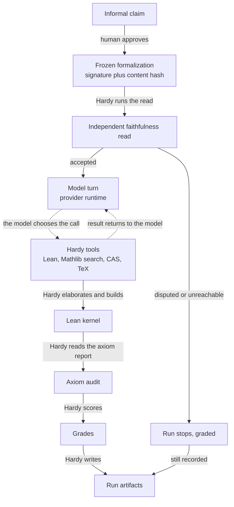
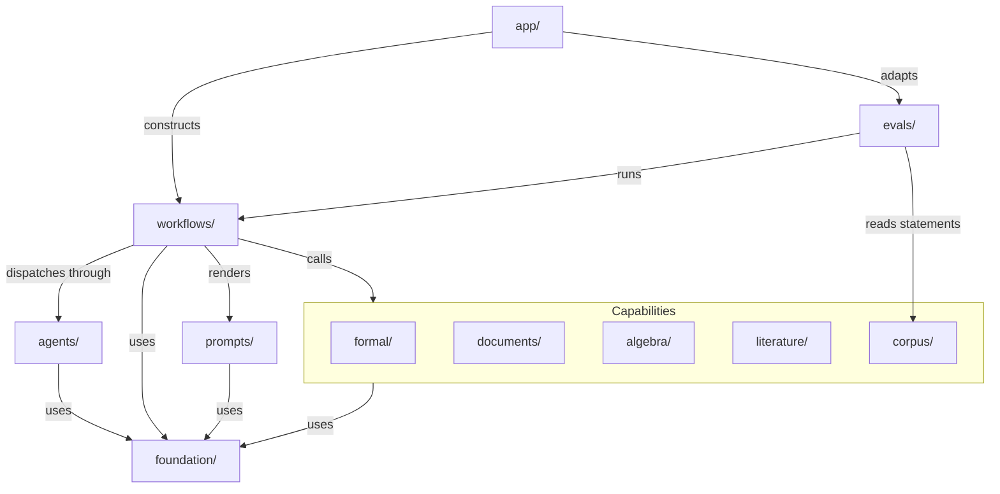

# Architecture overview

This page explains the shape of Hardy and the reasoning behind it, for a reader
who has run the tool once and wants to know what the pieces are before reading
any of them. It carries no status; what is planned lives in
[the roadmap](../roadmap.md).

Hardy is a harness for proving mathematics with a language model. The model
proposes: it writes a formalization, it writes Lean, it revises after an error.
Lean's kernel verifies, and nothing the model says about its own work is taken
as evidence of anything. Between those two, Hardy keeps the account: it freezes
what was claimed, runs every tool call itself, reads the axiom report rather
than the model's summary of it, and writes the artifacts a later reader can
check without rerunning anything. The model is replaceable. The account is not,
and almost every design decision below follows from wanting the account to stay
true when the model is wrong, careless, or simply persuasive.

## The core loop

Dashed arrows are the model's: it decides when a tool is called and what to
send it. Solid arrows are Hardy's, and there is no dashed arrow into the
kernel, the audit, the grades or the artifacts. That asymmetry is the whole
mechanism. A tool call is a request; the check that answers it is a real Lean
build or a real TeX compile that Hardy runs and records, and the record is
written whether or not the model likes the result.

The turn loop itself is not always Hardy's. On the `claude` backend the Claude
Code agent SDK owns the loop and Hardy's tools run in process behind it; the
`api` backend runs that loop inside Hardy instead, which is what lets a run
decline a further provider call rather than pay for a turn it does not need.
Either way the tools, the checks and the writes are Hardy's, and which
transport carried a run is part of that run's recorded identity. See
[configuration](../reference/configuration.md) for choosing between them.

Three of these steps deserve their reasons stated.

**The claim is frozen before any proving.** A formalization approved by the
user is stored with a content hash, so what a later artifact says was proved is
the statement the user saw and not a statement that drifted during the search.
A run cannot proceed to proving under a claim nobody approved, and an illegal
transition between stages raises rather than continues.

**The faithfulness read runs before the proof search, not after it.** Kernel
acceptance says a Lean statement was proved; it says nothing about whether that
statement is the claim the user made, and a proof of the wrong theorem is the
most expensive failure this harness can produce, precisely because every other
signal reads green. So a second model, given the user's words and the frozen
signature and nothing else, no formalization conversation and no Lean tools,
reads the translation first. Independence here is independence of context, not
just of weights: a reader handed the account that produced a translation reads
the translation through that account. The gate is fail-closed. A dispute stops
the run, and so does a reader that could not be reached or that answered with
something which is not a review; there is no third option that proceeds. A run
that stops here is not discarded: it is finalized as cancelled, and the reason
recorded distinguishes a translation that was refused from a read that could
not be obtained, because automation acts on the two differently.

**The audit reads what the proof spent, not what the run permitted.** Declared
assumptions say what a run was allowed to use. Only the kernel's own axiom
report says what a proof actually used, so that is what the grades carry. The
grades are orthogonal on purpose: a compiled document never implies a proved
theorem, and a verified theorem resting on an approved axiom is recorded as
verified modulo that axiom rather than as verified. See
[artifacts](../reference/artifacts.md) for the files this produces and
[the command reference](../reference/cli.md) for the commands that produce them.

The tools themselves are narrow and named. Lean and workspace verbs check,
save, read and delete files and record the correspondence between a Lean
declaration and its LaTeX name; TeX verbs check and save the writeup; search
verbs query Mathlib declarations and modules, inspect named declarations and
rank premises; paper verbs fetch, read and cite literature and list what a
source states; computer algebra verbs run, inspect, reset and export a
persistent kernel session. Two of them, requesting an assumption and assuming
a paper statement, end in a question rather than in a change. Assuming a paper
statement does substantial work first: Hardy elaborates the statement, searches
for a counterexample, and has an independent reader compare the Lean against
the paper's own words. What none of that work does is grant the approval. Only
a human does, one statement at a time, and approval is never assumed.
Reporting a result is refused unless the artifacts support it. The
same bounded runtime backs both the in-process tools and the MCP server, so a
client on the outside gets the same checks and the same records as the session
on the inside.

## Packages

Hardy stays one distribution and one installation. The packages are internal
owners, not deployables, and the arrows only ever point down: the construction
layer knows concrete implementations, workflows know capability APIs and narrow
runtime interfaces, capabilities do not import workflows or entry points, and
foundations import no capability at all.

`agents/` sits beside the capabilities rather than among them, because it is
the one owner workflows dispatch *through* rather than call. Provider code does
import a few things from `workflows/`, all of them value contracts, the run
store or a pure assembler, and it imports no controller and no entry point: a
provider that could reach the interactive session would be able to write the
record it is supposed to be a witness to. [Module
boundaries](module-boundaries.md) names the exact modules on both sides of that
line.

Paths below are relative to `src/hardy/`.

| Package | What it owns |
| --- | --- |
| `app/` | CLI, TUI, MCP entry points, configuration, project construction, installation and doctor checks |
| `workflows/` | Interactive sessions, staged proving, batch runs, approval and faithfulness, run storage and recorded-evidence readers |
| `agents/` | Provider adapters, conversation events, runtime interface, loops, compaction and usage |
| `formal/` | Lean syntax, environment identity, builds, retrieval, axiom policy and final verification |
| `documents/` | TeX syntax, completion checks, compilation, controlled writeups and export rendering |
| `algebra/` | Computer algebra backends, kernel protocol, persistent session state, replay and exports |
| `literature/` | Paper acquisition, guarded libraries, archive admission, statement inventory and bibliography |
| `corpus/` | Statement schema, taxonomy, content identity, loading, mechanical checks and releases |
| `evals/` | Experimental contracts, selection, source identity, sweeps, run execution, scoreboard validation and pooling |
| `foundation/` | Strict values, guarded files, paths, locks, process control and truncation |
| `prompts/` | Prompt rendering, prompt identity and packaged templates |

The package root holds only `__init__.py`, `__main__.py` and the `cli.py`,
`mcp_server.py` and `cas_driver.py` launch shims, which keep the old entry-point
spellings and contain no logic. Implementations are imported from their owning
package. Who may import whom, and what the test that enforces it actually
checks, is [module boundaries](module-boundaries.md).

## Five kinds of authority kept separate

Five different things can be true in a Hardy project, and collapsing any two of
them into one store is how a harness starts believing itself. Each has one
owner.

1. **Mathematical project state.** Which concepts, representations, scoped
   declarations, questions, conjectures, approaches, results, obligations and
   publication links exist. Owner: the project ledger under `workflows/`.
2. **Conversation history.** What the human and the model said, and which
   interactive branches were explored. Owner: the transcript and agent history.
3. **Automated run trajectory.** What an unattended run did: budgets, tool
   calls, costs and terminal reason. Owner: run artifacts and `evals/`.
4. **Formal evidence.** What Lean elaborated, what the kernel accepted, and
   which axioms and toolchain were reported. Owner: `formal/`.
5. **Literature evidence.** Exact source and version, source spans, statements
   and bibliography identity. Owner: `literature/`.

The ledger points at formal, literature, algebra, document and run evidence. It
does not copy that evidence and it cannot manufacture it, so a recorded status
is never itself a reason to accept anything; acceptance is denied unless a
reader authenticates the exact evidence and the exact decision. A conversation
may have a working view of a concept and an active mathematical context, but
neither is mathematical truth, and an ordinary local hypothesis is not the same
thing as widening the project's trusted assumption set. The longer argument for
this split, including the item kinds the ledger stores, is
[the research architecture](../research-architecture.md).

## What the boundaries do not provide

They do not confine execution. The package boundaries are engineering
isolation: they decide which module may import which, which owner performs a
write, and what a test can check without a live model. They do nothing about
what a process does once it starts. Lean, TeX, computer algebra kernels and
helper programs run unsandboxed, with the permissions of the account that ran
`hardy`, and a computer algebra cell in particular executes arbitrary code by
design. The model chooses what goes into those processes.

So the confinement has to come from the environment around Hardy rather than
from anything on this page: a machine you are willing to lose, credentials the
run cannot reach, and untrusted input treated as untrusted. The practical rules
for running it that way are their own page; until it exists,
[the roadmap](../roadmap.md) is where that work is tracked.
<!-- link guides/running-safely.md once it exists -->
