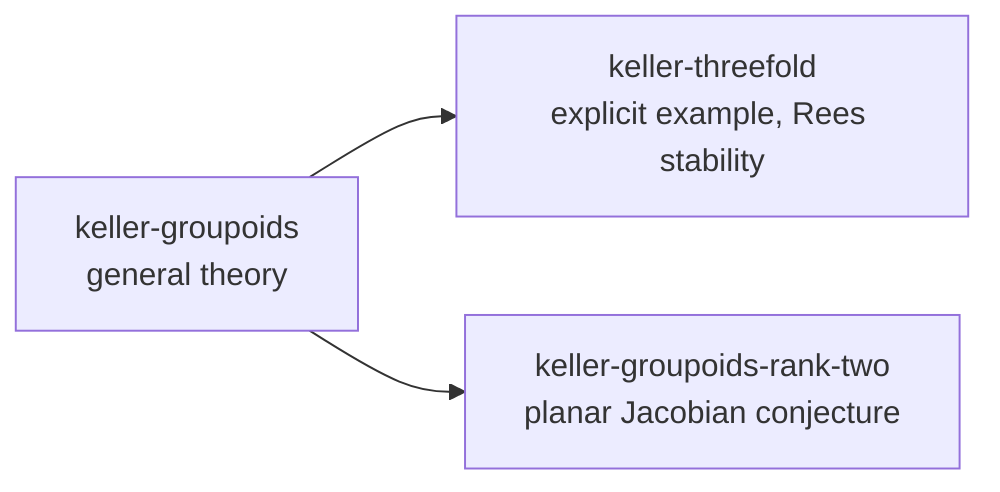

# Keller groupoids

A Hardy root holding three problems on the Keller-groupoid view of polynomial
maps with constant Jacobian determinant. It was assembled from the working
packet of 2026-09-14; [PROVENANCE.md](PROVENANCE.md) says where every packet
file went and [HARDY.md](HARDY.md) is what a session reads before it works here.

**Almost nothing here is verified, and what is verified says so precisely.**
Every claim came out of language-model work, and no claim has a claim-specific
human check. Seven items are `lean verified`: a Lean statement of the whole
claim was kernel-checked against Mathlib, Hardy's own axiom audit graded it,
and the acceptance sits in the problem's `evidence/` journal. Every other
mathematical item is `open` or `llm proved` with an open `prove` obligation.
Hardy's readers show exactly that: `/status --full` in any problem lists the
debt, grades every Lean declaration from the record, and names the literature
axioms a proof rests on.

## The three problems



| Problem | What it holds | Depends on |
| --- | --- | --- |
| `keller-groupoids` | The general theory of the Keller relation groupoid and its Čech nerve for a Keller map in any dimension: `KG-01`..`KG-21`, the reconstruction theorem `K12-01`, the thirteen shared definitions `DEF-*`, and the nine literature inputs the general arguments use. | nothing |
| `keller-threefold` | The explicit degree-three Keller map `A^3 → A^3`, its incidence normalization, the discriminant filling `X`, the rigid extended Rees algebra and the topological obstruction to cancellation: `K05-01`..`K13-02`, `K01-01`, and the groupoid description of the example `KG-F01`..`KG-F03`. | `keller-groupoids` (five mirrored items) |
| `keller-groupoids-rank-two` | Everything aimed at a plane Keller map: the configuration criteria `KG-PC*`, the global Euler-deficit identity `KG-E02`, the étale-maximality chain `KG-EM01`..`KG-EM10`, perfect monodromy `KG-PM*`, the degree-six `A_6` attack `KG-A6*`, the boundary-graph criteria, the planar program `KG-P*`, and twenty-six literature and external-research inputs. | `keller-groupoids` (eleven mirrored items) |

`keller-threefold` and `keller-groupoids-rank-two` do not depend on each other.
A downstream problem never proves an upstream item; it carries a **mirror**
(kind `external_result`, status `imported`) naming the upstream problem, item
and digest, and `tools/check.py` refuses a stale mirror.

### The board at the snapshot

| Problem | `lean verified` | `llm proved` | `open` | mirrors | literature inputs | definitions |
| --- | --- | --- | --- | --- | --- | --- |
| `keller-groupoids` | 1 | 21 | 2 | 0 | 9 | 13 |
| `keller-threefold` | 2 | 29 | 6 | 5 | 0 | 0 |
| `keller-groupoids-rank-two` | 4 | 31 | 15 | 11 | 24 published, 2 external research | 0 |

`tools/check.py` prints the current board. The seven kernel-verified claims:
`KG-14` (collision-free means automorphism, with Ax–Grothendieck as an explicit
hypothesis); `K06-01` (`det JF = -2` and the three-point collision of the
explicit map) and `K07-07` (the coordinate collision in the elimination
cubic); `KG-PC02` (deficit one forces one deleted sheet, given `KG-PC01`),
`KG-E02` (the Euler-deficit identity from its two Euler inputs), `KG-PM02`
(perfect monodromy is not `S_d`) and `KG-PM03` (the inertia parity). Each
item's `formal_proof` semantic names the declaration and its hypotheses.

## What is where

```
keller/
├── HARDY.md                    # read by every session opened here
├── README.md, PROVENANCE.md, citation-hygiene.md
├── .gitignore, .gitattributes  # keep .hardy/ tracked and every byte unconverted (the ledgers hash them)
├── .hardy/
│   ├── config.toml             # the project layer; sets nothing yet
│   └── lean/KellerGroupoids/   # shared Lean: Core, Interfaces, PublishedAxioms, ExternalResearchAxioms
├── tools/
│   ├── check.py                # the checks below, and the dependency-graph renderer
│   ├── record_lean.py          # build, audit with Hardy, record evidence, link declarations to claims
│   ├── lean-map.json           # which declaration formalises which claim, and how much of it
│   ├── build_ledgers.py        # one-time migration from the packet; refuses to run twice
│   └── packet-claims.json      # the migration table: every item, alias, edge and locator
└── <problem>/
    ├── session.json            # Hardy's record: the stored audit verdict of every declaration
    ├── ledger/                 # hash-chained transactions: the import, then the formalization pass
    ├── evidence/               # Hardy's evidence journal: one FormalEvidence and Decision per acceptance
    ├── lean/<Package>/*.lean   # KellerGeneral, KellerThreefold or KellerPlanar
    ├── tex/writeup.tex         # the document root; \input of the carried-over body
    ├── tex/<body>.tex
    └── notes/                  # the packet's prose, renamed; dependency-graph.md is generated
```

Each ledger item carries the packet's identifiers as `alias` semantics, its
Lean statement stub as `lean_declaration`, the manuscript or draft label as
`paper_label`, and an artifact reference (path, SHA-256, locator) into the note
or TeX body that states it. Relations are `depends_on` between items, `uses`
from an item to a literature input, `documents` from a note or TeX body to the
items it covers, and a few `illustrates`, `refines` and `supports` edges.

## Opening a problem

With Hardy installed:

```sh
hardy chat --root /path/to/keller --project keller-groupoids-rank-two
```

With no `--project`, the launch asks which of the three to open. `hardy web`
opens them through `Add existing` on the project menu. Lean, LaTeX and Tectonic
must be installed for anything past reading the record; `uv run hardy doctor`
says what is missing.

## Checking the root

The tools import Hardy's own ledger code, so run them in the environment Hardy
is installed in; from a Hardy checkout that is

```sh
uv run --project /path/to/hardy python tools/check.py                 # verify; print the board
uv run --project /path/to/hardy python tools/check.py --write-graphs  # also refresh notes/dependency-graph.md
```

The checker reads every ledger through Hardy's own store and verifies, per
problem: the status vocabulary; that nothing assessed above `open` depends on
something `open`; that the dependency graph is acyclic and the problem graph
is acyclic; that every mirror still matches its upstream item's digest and
status; that every `lean_declaration` exists under the problem's `lean/` or the
shared `.hardy/lean/`; that every artifact reference still matches the file;
and that every `lean verified` item has a resolved `prove` obligation whose
acceptance Hardy's own evidence readers authenticate from `evidence/`.

## Lean

Everything elaborates against Lean 4.33.1 and Mathlib v4.33.1 (Hardy's pins).
The packet's scaffold was replaced, not repaired:

- `.hardy/lean/KellerGroupoids/Core.lean` defines polynomial self-maps of
  `A^n` as tuples of `MvPolynomial`s, the Keller condition as a nonzero
  constant Jacobian determinant, and `KLevel`, `Conf`, `Fiber`, `fiberCard`
  as sets of points. No axioms.
- `Interfaces.lean` replaces the packet's `constant`s with `PlaneGeometry F`
  and `Geometry F`, records of the geometric notions the chains use
  (components of the nonproperness curve, inertia, étale-maximality,
  monodromy, ...) as uninterpreted data a theorem takes. A statement over the
  record has the claim's exact shape; it becomes a statement about varieties
  only when the fields are given meaning.
- `PublishedAxioms.lean` and `ExternalResearchAxioms.lean` state ten literature
  inputs as typed `axiom`s over the record, so an audit names exactly which a
  proof uses. The inputs that need notions the record lacks (Zariski Main,
  purity, Ramanujam–Morrow, Orevkov) have no Lean and the ledger says so.
- `keller-groupoids/lean/KellerGeneral/General.lean`: fourteen theorems, all
  kernel-verified on standard axioms: the set-level content of `KG-03`
  (partition decomposition as an equivalence), `KG-04`, `KG-06`, `KG-08`,
  `KG-09`, `KG-11`, `KG-14`, `KG-16`, `KG-17`, `KG-18`.
- `keller-threefold/lean/KellerThreefold/ExplicitMap.lean`: sixteen theorems,
  all kernel-verified: the explicit map, `det JF = -2`, the collisions, the
  binary-cubic identity behind `K06-02`, the parametrisation of `Γ`, and the
  `√3` fiber points of `K07-07`.
- `keller-groupoids-rank-two/lean/KellerPlanar/`: thirty-four theorems.
  Fifteen are kernel-verified (the permutation-group and arithmetic cores,
  `KG-PM02`, `KG-PM03`, `KG-PC02`, `KG-E02`); four are proved modulo named
  literature or external axioms and wait on their admission (`KG-P12`,
  `KG-A600`, the deficit arithmetic of `KG-A601`, and `KG-EM10`, which is
  derived from `KG-EM07`–`KG-EM09` exactly as the audit derives it); fifteen
  are typed statements ending in `sorry`, the open holes of the étale-maximality
  chain, perfect monodromy and the `A_6` packet.

Thirty-nine claims have no Lean statement; each carries a `formalization`
semantic naming what Mathlib v4.33.1 lacks for it (schemes, étale morphisms,
homology of varieties, Rees algebras, boundary graphs, braid monodromy).

`tools/record_lean.py` is the door between the Lean tree and the record. It
compiles every module with `lake env lean`, asks `#print axioms` for every
theorem, grades the answers with `hardy.formal.audit`, records each declaration
as a ledger item through Hardy's own save-path code (`ProjectOwners.record_saved`),
which mints the `FormalEvidence` and `Decision` records that resolve a verified
declaration's obligation, stores the verdicts in `session.json`, and then, from
`tools/lean-map.json`, links declarations to claims: a `full` declaration that
verified promotes its claim to `lean verified` and closes the claim's own
obligation on evidence minted for it; `core` and `statement` declarations only
annotate. It needs a Hardy checkout with the pinned Mathlib project
(`hardy setup`) and is rerunnable.

## TeX

Each problem's `tex/writeup.tex` is the packet document's preamble around one
`\input` of its body: the general draft in `keller-groupoids`, the theory audit
in `keller-groupoids-rank-two`, the July 2026 manuscript (v2.4) in
`keller-threefold`. The two pandoc-generated preambles compile under pdfLaTeX
and XeLaTeX; the manuscript is plain `article`.

## What the reorganization decided

The packet's ledgers used several naming schemes for one claim; each item keeps
one id and lists the others under `alias`. Items the packet tracked only by a
Lean declaration or a draft heading received ids in the same families
(`KG-13`..`KG-21`, `KG-E02`, `KG-EM07`..`KG-EM10`, `KG-PM01`..`KG-PM03`,
`KG-A600`..`KG-A605`, `KG-BG02`, `KG-BG04`).

Three items moved between the packet's groupings for the dependency direction
above: the reconstruction theorem `K12-01`, which is about every dimension, went
to `keller-groupoids` with its artifact still pointing into the manuscript;
`KG-O07` and `KG-O08`, which grow out of the explicit example, went to
`keller-threefold`; `KG-O03`..`KG-O06`, the planar routes, went to
`keller-groupoids-rank-two`.

Three packet dependency edges pointed from an `llm proved` item at an `open`
one (`KG-P07`, `KG-P09` and `KG-P12` on the program items `KG-P01`, `KG-P04`).
They were dropped, since a proved statement cannot rest on an open question,
and the original edge is kept on the item as `packet_depends_on`.

Everything the packet did not contain (a fifteen-file Lean scaffold, graph
renders, a boundary-graph script) is listed in PROVENANCE.md.
