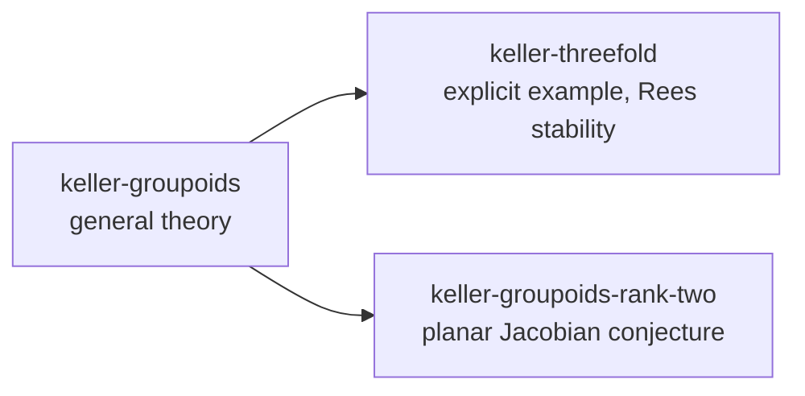

# Keller groupoids

A Hardy root holding three problems on the Keller-groupoid view of polynomial
maps with constant Jacobian determinant. It was assembled from the working
packet of 2026-09-14; [PROVENANCE.md](PROVENANCE.md) says where every packet
file went and [HARDY.md](HARDY.md) is what a session reads before it works here.

**Nothing here is verified.** Every claim came out of language-model work. At
the snapshot no claim carried a claim-specific human check and no Lean file had
been kernel-checked, so every mathematical item is recorded as `open` or
`llm proved` and every theorem-like item has an open `prove` obligation in its
ledger. Hardy's own readers show exactly that: `/status --full` in any of the
three problems lists the whole debt.

## The three problems



| Problem | What it holds | Depends on |
| --- | --- | --- |
| `keller-groupoids` | The general theory of the Keller relation groupoid and its Čech nerve for a Keller map in any dimension: `KG-01`..`KG-21`, the reconstruction theorem `K12-01`, the thirteen shared definitions `DEF-*`, and the nine literature inputs the general arguments use. | nothing |
| `keller-threefold` | The explicit degree-three Keller map `A^3 → A^3`, its incidence normalization, the discriminant filling `X`, the rigid extended Rees algebra and the topological obstruction to cancellation: `K05-01`..`K13-02`, `K01-01`, and the groupoid description of the example `KG-F01`..`KG-F03`. | `keller-groupoids` (five mirrored items) |
| `keller-groupoids-rank-two` | Everything aimed at a plane Keller map: the configuration criteria `KG-PC*`, the global Euler-deficit identity `KG-E02`, the étale-maximality chain `KG-EM01`..`KG-EM10`, perfect monodromy `KG-PM*`, the degree-six `A_6` attack `KG-A6*`, the boundary-graph criteria, the planar program `KG-P*`, and twenty-six literature and external-research inputs. | `keller-groupoids` (eleven mirrored items) |

`keller-threefold` and `keller-groupoids-rank-two` do not depend on each other.
A downstream problem never proves an upstream item; it carries a **mirror**
(kind `external_result`, status `imported`) naming the upstream problem, item
and digest, and `tools/check.py` refuses a stale mirror.

### The board at the snapshot

| Problem | `llm proved` | `open` | mirrors | literature inputs | definitions |
| --- | --- | --- | --- | --- | --- |
| `keller-groupoids` | 22 | 2 | 0 | 9 | 13 |
| `keller-threefold` | 31 | 6 | 5 | 0 | 0 |
| `keller-groupoids-rank-two` | 35 | 15 | 11 | 24 published, 2 external research | 0 |

`tools/check.py` prints the current board.

## What is where

```
keller/
├── HARDY.md                    # read by every session opened here
├── README.md, PROVENANCE.md, citation-hygiene.md
├── .gitignore, .gitattributes  # keep .hardy/ tracked and every byte unconverted (the ledgers hash them)
├── .hardy/
│   ├── config.toml             # the project layer; sets nothing yet
│   └── lean/KellerGroupoids/   # shared Lean: Core, Interfaces, PublishedAxioms, ExternalResearchAxioms
├── tools/
│   ├── check.py                # the checks below, and the dependency-graph renderer
│   ├── build_ledgers.py        # one-time migration from the packet; refuses to run twice
│   └── packet-claims.json      # the migration table: every item, alias, edge and locator
└── <problem>/
    ├── session.json            # Hardy's record; empty at the snapshot
    ├── ledger/                 # one hash-chained transaction holding the whole import
    ├── lean/KellerGroupoids/ProjectStatements/*.lean
    ├── tex/writeup.tex         # the document root; \input of the carried-over body
    ├── tex/<body>.tex
    └── notes/                  # the packet's prose, renamed; dependency-graph.md is generated
```

Each ledger item carries the packet's identifiers as `alias` semantics, its
Lean statement stub as `lean_declaration`, the manuscript or draft label as
`paper_label`, and an artifact reference (path, SHA-256, locator) into the note
or TeX body that states it. Relations are `depends_on` between items, `uses`
from an item to a literature input, `documents` from a note or TeX body to the
items it covers, and a few `illustrates`, `refines` and `supports` edges.

## Opening a problem

With Hardy installed:

```sh
hardy chat --root /path/to/keller --project keller-groupoids-rank-two
```

With no `--project`, the launch asks which of the three to open. `hardy web`
opens them through `Add existing` on the project menu. Lean, LaTeX and Tectonic
must be installed for anything past reading the record; `uv run hardy doctor`
says what is missing.

## Checking the root

The tools import Hardy's own ledger code, so run them in the environment Hardy
is installed in; from a Hardy checkout that is

```sh
uv run --project /path/to/hardy python tools/check.py                 # verify; print the board
uv run --project /path/to/hardy python tools/check.py --write-graphs  # also refresh notes/dependency-graph.md
```

The checker reads every ledger through Hardy's own store and verifies, per
problem: the status vocabulary; that nothing assessed above `open` depends on
something `open`; that the dependency graph is acyclic and the problem graph
is acyclic; that every mirror still matches its upstream item's digest and
status; that every `lean_declaration` exists under the problem's `lean/` or the
shared `.hardy/lean/`; that every artifact reference still matches the file;
and that nothing claims `human verified` or `lean verified`, since no evidence
for either exists yet.

## Lean

The packet's single Lake package was split. The definitions and the two axiom
files are the root's shared library, imported by every problem; each problem's
`ProjectStatements` files now import `KellerGroupoids.Interfaces` alone (plus
`ExternalResearchAxioms` where the degree-six chain consumes the frontier),
replacing the packet's linear import chain. No declaration was changed. As the
packet said of itself, none of it has been typechecked: `Interfaces.lean` uses
the Lean 3 keyword `constant`, the packet pinned Lean and Mathlib `v4.24.0`
while Hardy pins `v4.33.1`, and every `ProjectStatements` declaration is an
`axiom` standing in for a proof. The first Lean session here is a repair pass.

## TeX

Each problem's `tex/writeup.tex` is the packet document's preamble around one
`\input` of its body: the general draft in `keller-groupoids`, the theory audit
in `keller-groupoids-rank-two`, the July 2026 manuscript (v2.4) in
`keller-threefold`. The two pandoc-generated preambles compile under pdfLaTeX
and XeLaTeX; the manuscript is plain `article`.

## What the reorganization decided

The packet's ledgers used several naming schemes for one claim; each item keeps
one id and lists the others under `alias`. Items the packet tracked only by a
Lean declaration or a draft heading received ids in the same families
(`KG-13`..`KG-21`, `KG-E02`, `KG-EM07`..`KG-EM10`, `KG-PM01`..`KG-PM03`,
`KG-A600`..`KG-A605`, `KG-BG02`, `KG-BG04`).

Three items moved between the packet's groupings for the dependency direction
above: the reconstruction theorem `K12-01`, which is about every dimension, went
to `keller-groupoids` with its artifact still pointing into the manuscript;
`KG-O07` and `KG-O08`, which grow out of the explicit example, went to
`keller-threefold`; `KG-O03`..`KG-O06`, the planar routes, went to
`keller-groupoids-rank-two`.

Three packet dependency edges pointed from an `llm proved` item at an `open`
one (`KG-P07`, `KG-P09` and `KG-P12` on the program items `KG-P01`, `KG-P04`).
They were dropped, since a proved statement cannot rest on an open question,
and the original edge is kept on the item as `packet_depends_on`.

Everything the packet did not contain (a fifteen-file Lean scaffold, graph
renders, a boundary-graph script) is listed in PROVENANCE.md.
