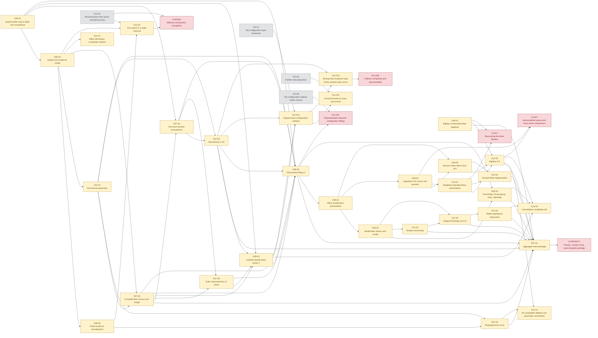

# Dependency graph: keller-threefold

Generated from `ledger/` by `tools/check.py --write-graphs`; do not edit. Solid
arrows are `depends_on`, dotted are `uses` (a published or external input).
Colours are the item's recorded research status, which certifies nothing:
red open, amber llm proved, blue human verified, green lean verified, grey a
mirror of another problem's item, dotted grey a literature input.

